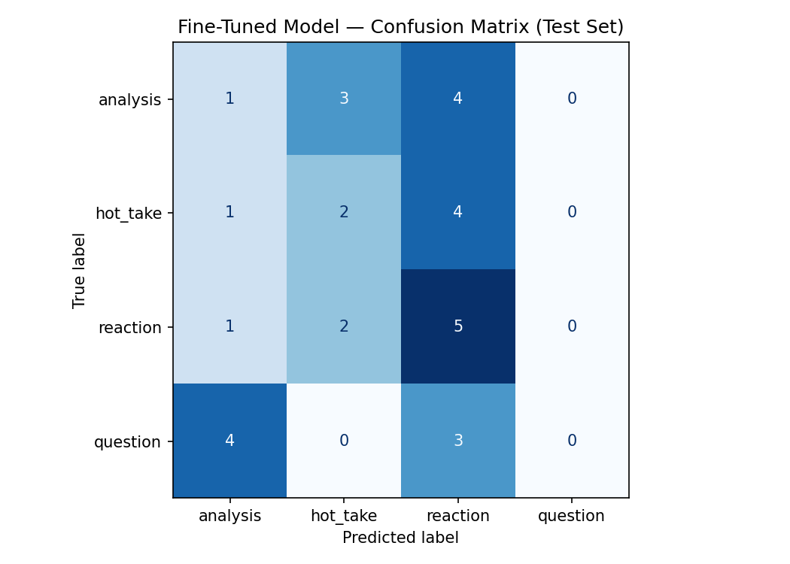

# TakeMeter: NBA Discussion Quality Classifier

TakeMeter is a text classification project that evaluates the style and quality of NBA online discussion comments. The goal is to classify each comment into one of four mutually exclusive discourse categories: `analysis`, `hot_take`, `reaction`, and `question`.

This project compares two approaches:

1. A zero-shot Groq baseline using `llama-3.3-70b-versatile`
2. A fine-tuned DistilBERT classifier trained on a 200-example NBA discussion dataset

## Community Choice

I chose NBA online discussion communities because basketball conversations contain several clear types of discourse. Some comments make thoughtful arguments about players, coaching, defense, trades, or team strategy. Others are emotional reactions to games and highlights. Some comments make bold claims without much evidence, while others ask genuine questions.

This made NBA discussion a good community for studying whether a model can distinguish between the purpose of a comment, not just its topic.

## Label Taxonomy

The classifier uses four labels.

### `analysis`

A comment is labeled `analysis` when it makes a structured basketball argument using evidence, reasoning, statistics, comparisons, tactical observations, or specific examples.

Example:

> The Nuggets are harder to guard when Jokic catches the ball at the elbow because it forces the defense to choose between helping on cutters or staying home on shooters.

### `hot_take`

A comment is labeled `hot_take` when it makes a strong or confident basketball claim with little, weak, or no supporting evidence.

Example:

> This team is cooked and has no chance in the playoffs.

### `reaction`

A comment is labeled `reaction` when it mainly expresses an immediate emotional response to a game, player, trade, injury, highlight, or news event without trying to build an argument.

Example:

> That dunk was insane. I still cannot believe he finished that.

### `question`

A comment is labeled `question` when its main purpose is to ask for clarification, explanation, prediction, or other people's opinions.

Example:

> Why do teams keep switching smaller guards onto Jokic instead of sending an early double?

## Data Source and Labeling Process

My original plan was to collect NBA discussion comments directly from Reddit communities, but direct Reddit collection returned HTTP 403 errors. To avoid fabricating data, I switched to a public Kaggle Reddit comments dataset and filtered it for NBA-related comments.

The final dataset contains 200 examples. I used `scripts/build_dataset_from_kaggle.py` to filter comments and build a balanced dataset with 50 examples per label. Because of time and API access limitations, I used rule-based prelabeling signals to speed up annotation. I then reviewed the label definitions and spot-checked examples for consistency, but the dataset likely still contains some label noise. This became an important limitation in the final results.

The final dataset is saved at:

```text
data/takemeter_dataset.csv
```

The dataset has three columns:

```text
text,label,notes
```

## Label Distribution

| Label     |   Count |
| --------- | ------: |
| analysis  |      50 |
| hot_take  |      50 |
| reaction  |      50 |
| question  |      50 |
| **Total** | **200** |

The dataset was intentionally balanced so that no label dominated the training process.

## Train / Validation / Test Split

The notebook split the dataset into training, validation, and test sets.

| Split      | Count |
| ---------- | ----: |
| Train      |   140 |
| Validation |    30 |
| Test       |    30 |

The test set contained:

| Label    | Test Count |
| -------- | ---------: |
| analysis |          8 |
| hot_take |          7 |
| reaction |          8 |
| question |          7 |

## Fine-Tuning Approach

I fine-tuned `distilbert-base-uncased` using the 200-example TakeMeter dataset.

The label map was:

```python
LABEL_MAP = {
    "analysis": 0,
    "hot_take": 1,
    "reaction": 2,
    "question": 3,
}
```

The dataset was tokenized using the DistilBERT tokenizer. The model was trained for 3 epochs and evaluated on the held-out test set.

Training results showed weak validation performance:

| Epoch | Validation Loss | Validation Accuracy |
| ----: | --------------: | ------------------: |
|     1 |           1.392 |               0.367 |
|     2 |           1.384 |               0.367 |
|     3 |           1.369 |               0.333 |

## Zero-Shot Baseline

For the baseline, I used Groq with `llama-3.3-70b-versatile`. The model received the label definitions and examples in the system prompt, then classified each test comment into exactly one of the four labels.

The baseline prompt instructed the model to return only one valid label:

```text
analysis
hot_take
reaction
question
```

The Groq baseline evaluated all 30 test examples successfully.

## Results Comparison

| Model                                              | Accuracy |
| -------------------------------------------------- | -------: |
| Zero-shot baseline: Groq `llama-3.3-70b-versatile` |    0.400 |
| Fine-tuned DistilBERT                              |    0.267 |

The fine-tuned model performed 0.133 accuracy points worse than the Groq baseline. This means fine-tuning caused a regression rather than an improvement.

## Baseline Metrics

| Label            | Precision | Recall | F1-score | Support |
| ---------------- | --------: | -----: | -------: | ------: |
| analysis         |      0.00 |   0.00 |     0.00 |       8 |
| hot_take         |      0.50 |   0.43 |     0.46 |       7 |
| reaction         |      0.32 |   0.75 |     0.44 |       8 |
| question         |      1.00 |   0.43 |     0.60 |       7 |
| **accuracy**     |           |        | **0.40** |      30 |
| **macro avg**    |      0.45 |   0.40 |     0.38 |      30 |
| **weighted avg** |      0.43 |   0.40 |     0.37 |      30 |

## Fine-Tuned Model Metrics

| Label            | Precision | Recall | F1-score | Support |
| ---------------- | --------: | -----: | -------: | ------: |
| analysis         |      0.14 |   0.12 |     0.13 |       8 |
| hot_take         |      0.29 |   0.29 |     0.29 |       7 |
| reaction         |      0.31 |   0.62 |     0.42 |       8 |
| question         |      0.00 |   0.00 |     0.00 |       7 |
| **accuracy**     |           |        | **0.27** |      30 |
| **macro avg**    |      0.19 |   0.26 |     0.21 |      30 |
| **weighted avg** |      0.19 |   0.27 |     0.21 |      30 |

## Fine-Tuned Confusion Matrix

Rows are true labels and columns are predicted labels.

| True Label \ Predicted Label | analysis | hot_take | reaction | question |
| ---------------------------- | -------: | -------: | -------: | -------: |
| analysis                     |        1 |        3 |        4 |        0 |
| hot_take                     |        1 |        2 |        4 |        0 |
| reaction                     |        1 |        2 |        5 |        0 |
| question                     |        4 |        0 |        3 |        0 |



## Error Analysis

The fine-tuned model struggled most with the `question` class. It never predicted `question` on the test set, even though the test set contained 7 true question examples. Those question examples were mostly misclassified as `analysis` or `reaction`.

The model also over-predicted `reaction`. Many true `analysis` and `hot_take` comments were classified as `reaction`, suggesting that the model learned surface-level emotional or conversational cues instead of deeper discourse purpose.

The main failure pattern was that the fine-tuned model did not reliably learn the difference between:

* a structured basketball argument
* a bold unsupported claim
* an emotional response
* a genuine question

This was likely caused by a combination of a small dataset, noisy rule-based prelabels, and blurry boundaries between discourse categories.

## What the Model Learned vs. What I Intended

I intended the model to learn discourse quality and comment purpose. For example, I wanted it to distinguish a supported argument from an unsupported hot take.

However, the fine-tuned model appears to have learned shallow text patterns instead. It often treated different kinds of NBA comments as emotional reactions and failed to recognize questions. This suggests that the model did not fully learn the intended taxonomy.

The Groq baseline performed better because the large language model could use the full label definitions and examples at inference time. The fine-tuned DistilBERT model only learned from the limited training examples, so noisy labels and weak class boundaries had a larger negative effect.

## Difficult Examples and Label Boundaries

Some NBA comments are hard to label because they contain more than one discourse function. For example, a comment can begin as a reaction and then include a short explanation. Another comment can ask a question while also implying a hot take. In these cases, I labeled the comment based on its main purpose.

The hardest boundary was between `analysis` and `hot_take`. A strong claim with one small reason can be difficult to classify. I treated comments as `analysis` only when they included meaningful reasoning, evidence, or specific basketball explanation. I treated comments as `hot_take` when the claim was mostly unsupported.

The second hardest boundary was between `reaction` and `hot_take`. Emotional claims about players or teams can look like hot takes, but I labeled them as `reaction` when the main purpose was immediate emotion rather than persuasion.

## Files in This Project

```text
planning.md
README.md
labeling_guide.md
data/takemeter_dataset.csv
evaluation_results.json
confusion_matrix.png
scripts/validate_dataset.py
scripts/dataset_progress.py
scripts/dedupe_dataset.py
scripts/import_raw_comments.py
scripts/label_comments.py
scripts/collect_reddit_comments.py
scripts/build_dataset_from_kaggle.py
```

## How to Run Dataset Validation

From the project root:

```bash
python scripts/validate_dataset.py
```

Expected result:

```text
Total examples: 200
analysis: 50
hot_take: 50
question: 50
reaction: 50
OK: dataset has at least 200 examples
OK: no label exceeds 70%
OK: no duplicate text examples
```

## Demo Video

Demo video link:

```text
PASTE DEMO VIDEO LINK HERE
```

In the demo, I show the dataset, the label taxonomy, the fine-tuning notebook, the baseline comparison, the confusion matrix, and sample predictions from the classifier.

## Reflection

This project showed me that fine-tuning is not automatically better than zero-shot prompting. I expected the fine-tuned DistilBERT model to beat the baseline because it trained directly on my dataset, but the opposite happened. The Groq baseline reached 0.400 accuracy, while the fine-tuned model reached only 0.267 accuracy.

The most important lesson is that dataset quality matters more than just training a model. A small dataset with noisy labels can cause a fine-tuned model to learn weak patterns. In this case, the rule-based prelabeling helped me build the dataset under time pressure, but it also likely introduced label noise.

If I continued this project, I would improve it by manually reviewing all 200 labels, adding more examples, creating clearer decision rules, and possibly using two annotators to check agreement. I would also improve the question class by adding more direct question examples and more examples where a question is mixed with analysis or opinion.

## Spec Reflection

My original plan was to collect Reddit comments directly from NBA communities. That plan changed because direct Reddit collection failed with HTTP 403 errors. Instead of inventing fake examples, I used a public Kaggle Reddit comments dataset and filtered it for NBA-related comments.

The project still followed the core goal of building a discourse-quality classifier for an online community. However, the data collection process became more script-based and rule-based than originally planned. This affected the final performance and became one of the main limitations of the project.

## AI Usage

I used AI assistance to help plan the project, design the label taxonomy, write data validation scripts, debug collection problems, structure the README, and interpret model results. I also used scripts to help filter and prelabel examples from the dataset.

I did not use AI to fabricate fake dataset examples. When direct Reddit collection failed, I switched to a public dataset source instead. I also did not commit any API keys to GitHub.
